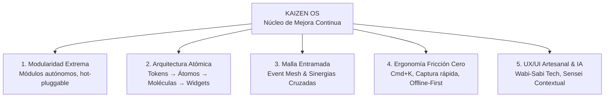
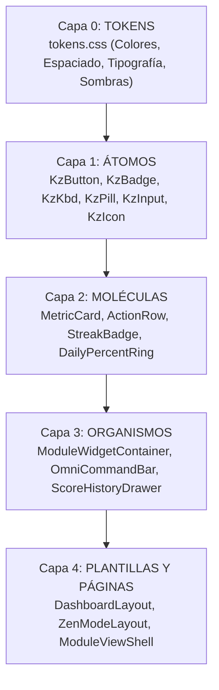
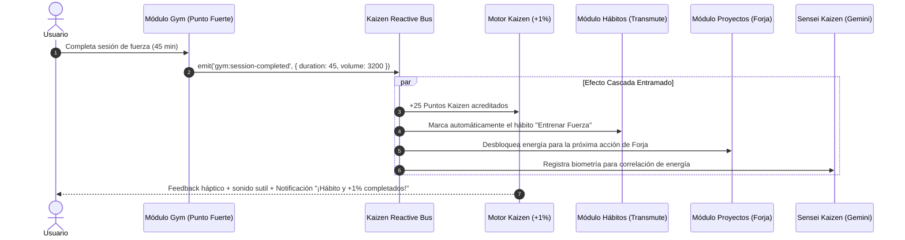
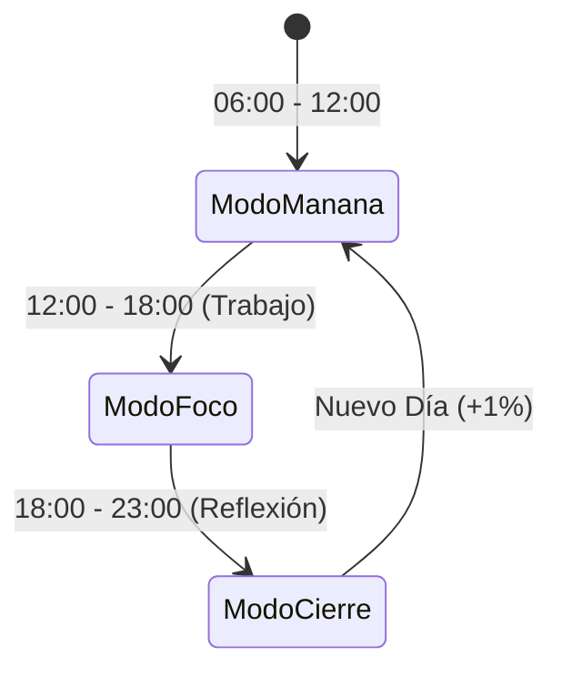
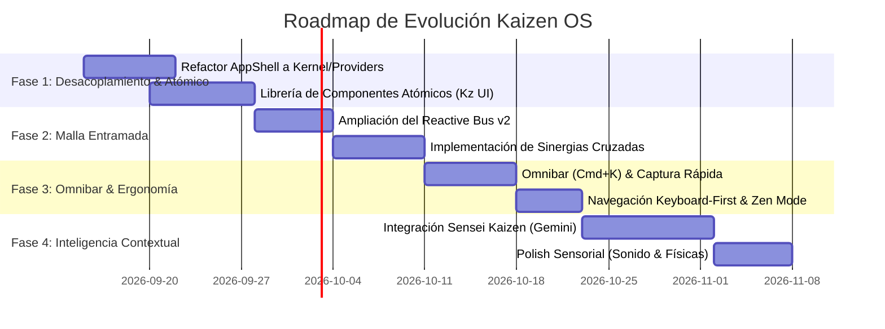

# KAIZEN OS · Plan Maestro de Decisiones Estratégicas y Arquitectura

> **Versión:** 2.0.0-PROPOSAL  
> **Estado:** Documento Vivo de Arquitectura y Diseño  
> **Enfoque:** Modularidad Extrema · Arquitectura Atómica · Ecosistema Entramado · Ergonomía Sin Fricción · UX/UI Artesanal e Innovador  

---

## 1. Manifiesto y Visión del Sistema

**Kaizen OS** no es una aplicación más de productividad; es un **entorno operativo personal** para la mejora continua sistemática basado en el principio:

$$\text{Avance Diario} \ge 1\% \implies (1.01)^{365} \approx 37.78 \text{ veces mejor al año}$$

Para cumplir esta promesa sin abrumar al usuario con fricción cognitiva ni sobrecarga técnica, el desarrollo del proyecto debe guiarse por 5 pilares indivisibles:



---

## 2. Pilar 1: Arquitectura Modular Extrema

### 2.1. Diagnóstico Actual y Refactorización del Shell
Actualmente, `AppShell.tsx` acumula más de 1,000 líneas con responsabilidades mezcladas (enrutador, modal de inspector, personalización de widgets, modal de puntuación y header). 

**Decisión Arquitectónica:**
Descomponer el monolito en capas y providers especializados bajo el patrón de **Micro-Kernel con Plugins**:

```
src/
├── app/
│   ├── providers/
│   │   ├── KaizenKernelProvider.tsx     # Contexto global: lifecycle, registry, bus
│   │   ├── ScoringProvider.tsx          # Motor de puntuación y rachas
│   │   └── ShellLayoutProvider.tsx      # Estados visuales (sidebar, modales, zen mode)
│   ├── layout/
│   │   ├── ShellHeader.tsx              # Barra superior con métricas del 1% y quick-actions
│   │   ├── ShellSidebar.tsx             # Navegación dinámica derivada del Registry
│   │   ├── ShellCommandBar.tsx          # Omnibar (Cmd+K)
│   │   └── ShellModals.tsx              # Orquestador perezoso de modales secundarios
│   └── AppShell.tsx                     # Orquestador limpio (< 120 líneas)
```

### 2.2. Contrato Formal de Módulo (Module Spec v3)
Todo módulo (hábitos, proyectos, gimnasio, finanzas, lectura o módulos comunitarios futuros) debe ser un paquete autónomo que declare sus capacidades sin acoplarse al núcleo:

```typescript
// src/sdk/schema.ts (Evolución v3)
export interface KaizenModuleDefinition<TSettings = Record<string, unknown>> {
  id: string;                          // Identificador único (ej: 'habits')
  name: string;                        // Nombre público (ej: 'TRANSMUTE')
  version: string;                     // SemVer
  category: ModuleCategory;            // 'Productividad' | 'Salud' | 'Finanzas' | ...
  icon: LucideIconName;
  description: string;
  
  // Capacidades declarativas
  entry: {
    path: string;                      // Ruta base (ej: '/habits')
    page: React.LazyExoticComponent<React.ComponentType>;
  };
  
  widgets: Array<{
    id: string;
    title: string;
    defaultSpan: 'third' | 'half' | 'full';
    component: React.LazyExoticComponent<React.ComponentType<ModuleWidgetProps>>;
  }>;
  
  storage: {
    namespace: string;                 // Prefijo forzoso para evitar colisiones
    version: number;
    migrations?: Record<number, (oldData: unknown) => unknown>;
  };

  events: {
    emits: Array<{
      event: string;                   // Formato 'modulo:accion' (ej: 'gym:workout-finished')
      points: number;                  // Puntos Kaizen asociados al hito
      description: string;
    }>;
    listens: Array<{
      event: string;
      handler: (payload: unknown) => void;
    }>;
  };

  quickActions?: Array<{
    id: string;
    label: string;
    icon: LucideIconName;
    shortcut?: string;
    action: () => void;
  }>;

  settingsSchema?: z.ZodType<TSettings>;
}
```

### 2.3. Aislamiento de Almacenamiento (Storage Sandboxing)
- **Regla:** Ningún módulo puede acceder directamente a claves arbitrarias de `localStorage`.
- **Implementación:** `createModuleStorage(namespace)` envuelve el acceso asegurando que cada módulo solo lea/escriba en `kz:<namespace>:*`.
- **Evolución Local-First:** Integrar una capa sobre **IndexedDB** (vía Dexie o idb-keyval) con sincronización opcional y exportación/importación en formato JSON atómico (`kaizen-backup-YYYY-MM-DD.json`).

---

## 3. Pilar 2: Arquitectura y Sistema de Diseño Atómico

Se adopta la jerarquía de **Atomic Design** adaptada a Tailwind CSS v4 y a la estética artesanal ("Wabi-Sabi Tech / Neo-Craft").



### 3.1. Tokenomics Visual ("Wabi-Sabi Craftsmanship")
Se consolida la paleta cálida basada en papel porcelana y tinta ferrosa para evitar la frialdad sintética del software corporativo:

| Token | Propósito | Valor CSS | Sensación de Marca |
|---|---|---|---|
| `--color-kz-bg` | Fondo General | `#f4f2ec` | Papel pergamino claro / Porcelana |
| `--color-kz-surface` | Tarjetas y Paneles | `#fffdf8` | Superficie pura, limpia |
| `--color-kz-ink` | Tipografía Primaria | `#211d19` | Tinta de pluma / Carbón cálido |
| `--color-kz-line` | Separadores y Bordes | `#d9d3c5` | Encuadernación editorial |
| `--color-kz-accent` | Acento Primario | `#b45309` | Ámbar forja / Bronce |
| `--color-kz-accent-habits` | TRANSMUTE | `#0f6b6b` | Verdigris alquímico |
| `--color-kz-accent-gym` | Punto Fuerte | `#dc2626` | Carmesí de potencia y ritmo |
| `--color-kz-accent-forja` | FORJA | `#b45309` | Hierro candente |

### 3.2. Catálogo de Átomos y Primitivas de UI
Para que los desarrolladores de módulos construyan interfaces uniformes en minutos:
1. **`KzButton`**: Soporta variantes `craft` (borde táctil sutil), `primary` (tinta oscura), `ghost` y `destructive`.
2. **`KzCard`**: Superficie con borde `--color-kz-line`, sombra `--shadow-kz-card` y micro-transición al hover (`translate-y-[-1px]`).
3. **`KzScorePill`**: Indicador atómico de puntos (`+15 pts`) con animación sutil de destello en color ámbar.
4. **`KzRingProgress`**: SVG circular matemático para visualizar el avance del 1% diario con animación interpolada por Framer Motion.
5. **`KzHotKey`**: Etiqueta visual para atajos de teclado (`⌘K`, `Esc`, `G D`).

---

## 4. Pilar 3: Ecosistema Entramado (Mesh Reactive & Cross-Module Synergies)

El salto cuántico de **Kaizen OS** radica en que los módulos **no operan como islas**, sino como un tejido interconectado. Las acciones en un área de la vida nutren las demás.



### 4.1. Matriz de Sinergias Cruzadas (Cross-Domain Ripples)

| Disparador (Módulo Origen) | Evento Emitido | Reacción en Módulo Destino | Efecto en Kaizen Score |
|---|---|---|---|
| **Gym (Punto Fuerte)** | `gym:session-completed` | **Hábitos:** Completa hábito diario de ejercicio sin doble captura manual. | +25 pts base + bono de racha. |
| **Hábitos (Transmute)** | `habits:all-daily-done` | **Dashboard:** Enciende el sello de "Día Dorado" en la bitácora. | +30 pts extra por disciplina completa. |
| **Proyectos (Forja)** | `forja:milestone-completed` | **Finanzas:** Si hay presupuesto de recompensa asignado, libera el fondo de ocio. | +50 pts de alto impacto. |
| **Lectura** | `reading:session-finished` | **Proyectos:** Sugiere crear una nota/acción en Forja a partir de citas destacadas. | +15 pts por nutrición cognitiva. |
| **Finanzas** | `finance:savings-target-hit` | **Hábitos:** Refuerza el hábito de frugalidad/inversión mensual. | +20 pts por salud financiera. |

### 4.2. Tipado Estricto del Bus Central
```typescript
// src/sdk/contracts.ts
export const KaizenEventContracts = {
  // Gimnasio
  GymSessionCompleted: contract<{ durationMinutes: number; intensity: 'low' | 'mid' | 'high' }>('gym:session-completed'),
  // Hábitos
  HabitToggled: contract<{ habitId: string; completed: boolean; streak: number }>('habits:toggled'),
  HabitsDayPerfect: contract<{ date: string; count: number }>('habits:all-daily-done'),
  // Proyectos
  ProjectNextActionDone: contract<{ projectId: string; taskName: string }>('forja:next-action-done'),
  ProjectCompleted: contract<{ projectId: string; name: string }>('forja:project-completed'),
  // Finanzas
  ExpenseLogged: contract<{ category: string; amount: number }>('finance:expense-logged'),
  // Sistema
  KaizenGoalReached: contract<{ totalToday: number; streak: number }>('kaizen:daily-goal-reached'),
};
```

---

## 5. Pilar 4: Ergonomía y Facilidad de Uso (Zero-Friction UX)

### 5.1. El Centro de Mando Global (Omnibar `Cmd+K`)
La principal causa de abandono de un sistema de auto-gestión es la fricción de entrada (tener que abrir 5 pestañas distintas para registrar una tarea, un gasto y un set de pesas).

**Solución:** Una barra universal de comandos inteligente accesible en cualquier momento mediante `Cmd+K` (Mac) o `Ctrl+K` (Windows/Linux):

```
┌────────────────────────────────────────────────────────────────────────┐
│ 🔍 Escribe un comando o captura rápida...                     [Esc]   │
├────────────────────────────────────────────────────────────────────────┤
│ ACCIONES RÁPIDAS INTELIGENTES:                                         │
│  ✓  Marcar hábito: "Lectura 20 min"                           [Enter]  │
│  ⚡  Iniciar entrenamiento: "Torso Hipertrofia (Rutina A)"              │
│  +  Nueva próxima acción en FORJA: "Diseñar wireframe"                 │
│  $  Registrar gasto: "12 café"                                         │
│                                                                        │
│ NAVEGACIÓN DIRECTA:                                                    │
│  →  Ir al Taller FORJA                                        [G F]    │
│  →  Ir a TRANSMUTE (Hábitos)                                  [G H]    │
│  →  Ir a Punto Fuerte (Gym)                                   [G G]    │
└────────────────────────────────────────────────────────────────────────┘
```

### 5.2. Navegación "Keyboard-First"
Atajos mnemónicos estilo Vim/Superhuman:
- `G` luego `D` → Ir a **D**ashboard
- `G` luego `H` → Ir a **H**abits (Transmute)
- `G` luego `F` → Ir a **F**orja (Proyectos)
- `G` luego `G` → Ir a **G**ym (Punto Fuerte)
- `Z` → Alternar **Zen Mode** (oculta barras, se enfoca únicamente en la próxima acción del día)
- `?` → Modal interactivo con el plano de atajos

### 5.3. Filosofía "No-Guilt" (Anti-Burnout)
- Los sistemas tradicionales castigan con cruces rojas los días sin actividad, generando culpa y abandono.
- **Enfoque Kaizen OS:** La racha no se destruye de golpe; existe el concepto de **"Día de Pausa Consciente"** o recuperación. Una micro-acción de 2 minutos es suficiente para validar el día. El progreso acumulado jamás se pierde.

---

## 6. Pilar 5: Innovación en Experiencia e Interfaz (UX/UI de Próxima Generación)

### 6.1. Dashboard Espacial y Adaptativo
El dashboard deja de ser una lista estática de cajas para convertirse en una superficie viva:
- **Masonry Grid Drag & Drop:** Los widgets pueden reorganizarse con un gesto natural (usando `@dnd-kit` o reorder nativo de Framer Motion).
- **Vistas por Contexto:** Selector de modo en el header:
  - `Mañana`: Prioriza hábitos matutinos y rutina de gimnasio.
  - `Foco Profundo`: Oculta finanzas y widgets secundarios; muestra únicamente la próxima acción de Forja y el temporizador.
  - `Cierre Nocturno`: Prioriza lectura, bitácora y reflexión del día.



### 6.2. Sensei Kaizen (IA Contextual con Google Gemini)
En lugar de un chat genérico desconectado, el Sensei actúa como un analista holístico silencioso:
1. **Auditoría Cruzada Semanal:** Lee las métricas de todos los módulos habilitados (horas de sueño/gym vs. tareas completadas en Forja vs. libros leídos).
2. **Recomendaciones Basadas en Hechos:** *"Alex, los días que entrenas pierna por la mañana tu ratio de finalización de tareas en Forja sube un 40%. Hoy tienes energía alta: aborda la tarea 'Arquitectura de Datos'."*
3. **Generación Automática de Bitácora:** Redacta un micro-resumen diario de 3 líneas listo para guardar en la bitácora con 1 clic.

### 6.3. Física Sensorial y Retroalimentación Háptica Digital
- **Animaciones con Física de Resortes:** Transiciones suaves usando Framer Motion (`stiffness: 300, damping: 25`).
- **Paisaje Sonoro Sutil (Web Audio API):** Clics orgánicos de madera o piedra al marcar tareas (opcionales y desactivables), aportando una sensación de tangibilidad física al software.
- **Exportación Visual (`html-to-image`):** Tarjeta infográfica diaria con el sello de cera de Kaizen OS para compartir logros en redes o archivar en notas personales.

---

## 7. Plan de Ejecución por Fases (Roadmap Incremental)



### Fase 1: Limpieza del Núcleo y Sistema Atómico (Semana 1-2)
- [ ] Extraer subcomponentes de `AppShell.tsx` hacia `src/app/layout/` y `src/app/providers/`.
- [ ] Implementar la carpeta `src/components/ui/` con los átomos base: `KzButton`, `KzCard`, `KzBadge`, `KzScorePill`.
- [ ] Aplicar tokens CSS `--color-kz-*` uniformemente en todos los widgets existentes.

### Fase 2: Malla de Eventos y Sinergias (Semana 3-4)
- [ ] Extender `src/sdk/bus.ts` con tipado estricto para eventos cross-module.
- [ ] Configurar los listeners en TRANSMUTE (Hábitos) para auto-completar hábitos derivados de entrenamientos en Punto Fuerte.
- [ ] Conectar FORJA (Proyectos) para que la compleción de hitos impacte automáticamente en las métricas de avance del día.

### Fase 3: Omnibar y Captura Rápida (Semana 5)
- [ ] Crear el componente `ShellCommandBar.tsx` montado a nivel raíz con escucha de `Cmd+K` / `Ctrl+K`.
- [ ] Conectar parsing de lenguaje natural simple (`"gasto 15 almuerzo"`, `"hábito agua"`, `"nota forja"`).
- [ ] Añadir modal interactivo de atajos con la tecla `?`.

### Fase 4: Sensei Kaizen e Innovación Sensorial (Semana 6+)
- [ ] Conectar el SDK `@google/genai` (ya presente en `package.json`) a través de un endpoint local o serverless seguro.
- [ ] Añadir motor de síntesis de día ("El resumen del Sensei") en el Dashboard.
- [ ] Añadir micro-sonidos táctiles con Web Audio API sintetizado (sin necesidad de cargar archivos MP3 pesados).

---

## 8. Guía de Contribución para Nuevos Módulos

Para crear un nuevo módulo dentro de Kaizen OS (ej: `journal`, `nutrition`, `meditation`), el desarrollador debe seguir esta receta canónica:

1. **Crear carpeta:** `src/modules/<modulo>/`
2. **Definir Manifiesto:** Crear `manifest.ts` exportando la especificación que cumpla `KaizenModuleDefinition`.
3. **Declarar Eventos:** Registrar en `spec.events.emits` qué acciones otorgan puntos Kaizen y qué datos emiten al bus.
4. **Construir el Widget:** Crear `<Modulo>Widget.tsx` utilizando exclusivamente componentes atómicos `Kz*` y tokens `--color-kz-*`.
5. **Construir la Página:** Crear `<Modulo>Page.tsx` con carga perezosa (`lazy()`).
6. **Registrar:** Añadir una línea en `src/app/moduleRegistry.ts`. El Shell se encargará del resto de forma 100% autónoma.

---

> *"No temas avanzar lentamente; teme únicamente quedarte quieto."*  
> — Proverbio Kaizen
