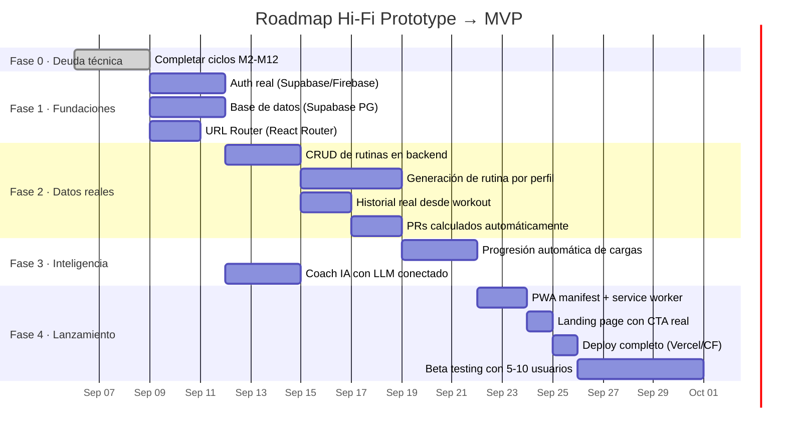

# Auditoría de Deuda Técnica — Punto Fuerte

> Septiembre 2026 · Fase: **Prototipo Hi-Fi → MVP**

---

## Diagnóstico de Madurez del Proyecto

### Escala de referencia

```
Wireframe → Lo-Fi Prototype → Hi-Fi Prototype → Pre-MVP → MVP → Producción
                                     ▲
                                     │
                              ESTAMOS AQUÍ
```

### Veredicto: **Prototipo de Alta Fidelidad** (Hi-Fi Prototype)

El proyecto tiene una UI completa, pulida y funcional con 42 componentes, 229 tests, un motor alométrico sofisticado y una capa serverless opcional. Sin embargo, **no es un MVP** porque carece de las capacidades fundamentales para que un usuario real lo use de forma autónoma y sostenida.

---

## Inventario: Qué funciona vs. qué es simulado

### ✅ Funcional (valor real)

| Capacidad | Implementación | Calidad |
|---|---|---|
| UI completa dark-mode | 42 componentes React, responsive desktop+mobile | 🟢 Alta |
| Motor alométrico | `allometricService.ts` — Kleiber x^(3/4), cardíaca x^(-1/4), fuerza x^(2/3) | 🟢 Alta |
| Workout tracker | Cronómetro, log de sets, timer de descanso, persistencia en localStorage | 🟢 Alta |
| Historial de sesiones | Log completo con calorías alométricas, potencia y feedback IA | 🟢 Media |
| Coach IA local | Motor rule-based con 8 temas (`coachEngine.ts`) + fallback serverless | 🟢 Media |
| Biblioteca de ejercicios | 1,324 ejercicios con filtros, búsqueda, detalle modal | 🟢 Alta |
| Onboarding | Flujo de 5 pasos que calibra el perfil del usuario | 🟢 Alta |
| Persistencia local | `usePersistedState` en localStorage para user, rutinas, historial, chat, workout | 🟢 Media |
| Tests | 229 tests en 30 archivos, lint 0 errores, Prettier 100% | 🟢 Alta |
| Capa serverless | `functions/api/coach.ts` compatible Cloudflare, con puerta a LLM real | 🟡 Media |
| Code splitting | Lazy imports de todas las vistas principales | 🟢 Alta |
| Error handling | `ErrorBoundary`, timeouts, fallbacks | 🟢 Media |

### 🟡 Simulado (parece real pero no lo es)

| Capacidad | Qué hace realmente |
|---|---|
| **Autenticación** | `loginDemoUser()` pone `isAuthenticated = true` sin verificar nada. No hay backend, ni tokens, ni sesiones reales. |
| **Datos de usuario** | Siempre arranca con "Carlos Ramírez" hardcodeado en `mockUser.ts`. El registro solo llama `updateUserProfile` y navega al onboarding. |
| **Rutinas** | Precargadas de `mockRoutines.ts` (817 ln). No se generan dinámicamente según el perfil del usuario. |
| **Historial** | Precargado de `mockProgress.ts` con sesiones ficticias. |
| **Records personales** | `MOCK_PRS` estático, nunca se actualiza con datos reales del tracking. |
| **Peso corporal** | Se puede editar pero el historial de peso es mock estático. |
| **Recuperación de contraseña** | Muestra "¡Enlace simulado enviado!". |
| **Telemetría cardíaca** | `useTelemetrySimulation` simula BPM con un modelo matemático. No hay sensor real. |
| **Coach IA inteligente** | Sin LLM configurado, solo responde a 8 patrones de keywords. |

### 🔴 Ausente (requerido para MVP)

| Capacidad | Por qué es crítica para MVP |
|---|---|
| **Backend / Base de datos** | No hay servidor propio. Todo es localStorage = no hay datos reales, no hay multi-dispositivo, no hay persistencia duradera. |
| **Autenticación real** | Sin auth real no hay usuarios reales. |
| **Generación dinámica de rutinas** | Las rutinas mock son el mismo plan para todos. Un usuario nuevo necesita que el onboarding genere SU rutina. |
| **Progresión automática** | No hay lógica de sobrecarga progresiva: el peso sugerido nunca cambia basado en rendimiento previo. |
| **Sincronización** | Si el usuario borra localStorage pierde todo. |
| **Deploy funcional** | GitHub Pages sirve el SPA estático pero sin backend las funciones serverless no están conectadas. |
| **URL routing** | Navegación por estado React (`currentScreen`), no hay URLs. No se puede compartir un enlace ni usar el botón atrás del navegador. |

---

## Plan de Ruta hacia MVP

> **Definición de MVP**: Un usuario real puede registrarse, obtener una rutina personalizada, entrenar con tracking real, ver su progreso acumulado y volver al día siguiente con sus datos intactos.

### Fases



---

### Fase 0 — Completar deuda técnica pendiente

> Prerrequisito: dejar la base de código limpia antes de construir encima.

| Ciclo | Acción | Estado |
|---|---|---|
| **M1** | ~~Comprimir documentación~~ | ✅ |
| **M3** | ~~Fijar versiones, evaluar lucide-react, limpiar artefactos~~ | ✅ |
| **M6** | ~~Array declarativo de rutas compartido~~ | ✅ |
| **M7** | ~~Co-ubicar constantes~~ | ✅ |
| **M2** | ~~Lazy-import de `mockRoutines`/`mockProgress`~~ | ✅ |
| **M5** | ~~Inline de componentes de 1 uso~~ | ✅ |
| **M8** | ~~Externalizar `exercisesDatabase.json` a CDN/fetch~~ | ✅ |
| **M9** | ~~Auditar API pública de `allometricService`~~ | ✅ |
| **M10** | Fusionar tests redundantes | ⬜ |
| **M11** | ~~Auditar endpoints serverless~~ | ✅ |
| **M4** | Descomponer `AppContext` → hooks de dominio | ⬜ |
| **M12** | ~~Nueva línea base~~ | ✅ |

### Fase 1 — Fundaciones (sin esto no hay MVP)

| ID | Tarea | Detalle | Riesgo | Est. |
|---|---|---|---|---|
| **F1.1** | **Autenticación real** | Integrar Supabase Auth (o Firebase Auth). Email/password + OAuth Google. Reemplazar `loginDemoUser()` por flujo real con tokens JWT. Proteger rutas. | 🟠 | 3 d |
| **F1.2** | **Base de datos** | Supabase PostgreSQL (o Firestore). Tablas: `users`, `routines`, `workout_logs`, `chat_history`. Migrar de localStorage a API REST/RPC. Mantener localStorage como caché offline. | 🟠 | 3 d |
| **F1.3** | **URL Router** | Instalar `react-router-dom`. Reemplazar `currentScreen` por rutas reales (`/dashboard`, `/routine`, `/workout/:id`, etc.). Soporte para botón atrás, deep links y compartir URLs. | 🟡 | 2 d |
| **F1.4** | **Eliminar datos mock del flujo principal** | `mockRoutines.ts` y `mockProgress.ts` solo se usan para seed/demo. El flujo de un usuario nuevo arranca vacío y genera su rutina en el onboarding. | 🟡 | 1 d |

### Fase 2 — Datos reales

| ID | Tarea | Detalle | Riesgo | Est. |
|---|---|---|---|---|
| **F2.1** | **CRUD de rutinas en backend** | El usuario puede crear, editar y borrar rutinas. Las rutinas se persisten en la base de datos y se sincronizan al cargar la app. | 🟡 | 3 d |
| **F2.2** | **Generación dinámica de rutina** | Al completar el onboarding, el sistema genera una rutina personalizada basada en: objetivo, experiencia, días/semana, equipamiento disponible y lesiones. Puede usar el motor rule-based o un LLM. | 🟠 | 4 d |
| **F2.3** | **Historial real desde workout** | Las sesiones completadas (`finishWorkout`) se guardan en la base de datos. El historial se carga desde el backend, no desde mock. | 🟡 | 2 d |
| **F2.4** | **Records personales automáticos** | Al finalizar un workout, comparar cada ejercicio con el historial previo. Si se superó un récord (peso × reps), registrarlo automáticamente. Eliminar `MOCK_PRS`. | 🟡 | 2 d |

### Fase 3 — Inteligencia

| ID | Tarea | Detalle | Riesgo | Est. |
|---|---|---|---|---|
| **F3.1** | **Progresión automática de cargas** | Implementar la "Regla del 2×2": si el usuario completa 2 reps extra en la última serie durante 2 sesiones consecutivas, aumentar el peso sugerido (+1.25 kg superior, +2.5 kg inferior). Ajustar `suggestedWeightKg` en la rutina. | 🟡 | 3 d |
| **F3.2** | **Coach IA con LLM conectado** | Configurar `COACH_LLM_API_URL` en producción (OpenRouter/OpenAI). Enriquecer el contexto del prompt con historial reciente del usuario (últimas 3 sesiones, PRs, tendencias). El motor local sigue como fallback. | 🟡 | 3 d |

### Fase 4 — Lanzamiento

| ID | Tarea | Detalle | Riesgo | Est. |
|---|---|---|---|---|
| **F4.1** | **PWA** | `manifest.json`, service worker con Workbox, íconos, splash screen. Instalable en móvil. Cache de assets estáticos para uso offline. | 🟢 | 2 d |
| **F4.2** | **Landing page con CTA real** | Actualizar `LandingPage.tsx` para apuntar a registro real en vez de demo. Eliminar el botón "Acceder con Carlos Ramírez". | 🟢 | 1 d |
| **F4.3** | **Deploy completo** | Frontend en Vercel/Cloudflare Pages. Backend Supabase. Functions serverless en Cloudflare Workers. Variables de entorno configuradas. SSL, dominio custom. | 🟡 | 1 d |
| **F4.4** | **Beta testing** | Invitar a 5-10 usuarios reales. Recoger feedback. Iterar sobre bugs y UX. | 🟢 | 5 d |

---

## Estimación total: Hi-Fi Prototype → MVP

| Fase | Esfuerzo estimado |
|---|---|
| Fase 0 (deuda técnica restante) | ~8 h |
| Fase 1 (fundaciones) | ~9 d |
| Fase 2 (datos reales) | ~11 d |
| Fase 3 (inteligencia) | ~6 d |
| Fase 4 (lanzamiento) | ~9 d |
| **Total** | **~35 días de trabajo** |

> [!IMPORTANT]
> La **Fase 1** es el bloqueo crítico. Sin autenticación real y base de datos, todas las demás fases son imposibles. Priorizar F1.1 y F1.2 en paralelo.

---

## Historial de ciclos completados (1–53)

> Los diffs completos están en el historial de git. Aquí solo el índice.

| # | Tema | Tipo |
|---|---|---|
| 1 | Motor Coach → `coachEngine.ts`, hook `useApp`, capa serverless | P1/P2 arch |
| 2 | Split `mockData`, helper `withMinDelay`, descomposición `RoutineView` | P3 refactor |
| 3 | Descomposición `OnboardingFlow`, formato global Prettier | P3 refactor |
| 4 | `COACH_THINKING_DELAY_MS` a constants, smoke tests | P3 limpieza |
| 5 | A11y labels del onboarding, tests de interacción | P3 a11y |
| 6 | Puerta a LLM real en `functions/api/coach.ts` | P3 feature |
| 7 | README serverless/LLM, smoke `ActiveWorkoutView`, `useCallback` | P3 docs+test |
| 8 | Badge de origen de respuesta del Coach en UI | P3 feature |
| 9 | Cobertura badges Coach, vitest `vmThreads` | P3 test+perf |
| 10–53 | Tests, persistencia, a11y, refactors, cobertura | P3 varios |

### Ciclos de minimalización completados

- **M1** ✅ — Documentación comprimida de 54→8 KB.
- **M2** ✅ — Lazy-import de `mockRoutines` y `mockProgress` en AppContext. **Corrección posterior**: el seeding asíncrono hacía crashear todas las vistas en el primer render (32 tests fallando). Se revirtió el seeding a **síncrono** (estado inicial con mocks en `useState`), se eliminó el efecto `loadMocks` y `resetToDemoData`/`resetRoutines` usan ahora los imports estáticos (reset determinista). Se añadieron guards de estado vacío en `DashboardView`, `RoutineView` y `ProgressView`.
- **M3** ✅ — Versiones fijadas, `metadata.json` eliminado, `lucide-react` mantenido.
- **M6** ✅ — `navigation.ts` compartido por `SidebarNav`/`MobileNav`.
- **M7** ✅ — Constantes co-ubicadas en sus módulos consumidores.
- **M5** ✅ — Componentes de un solo uso inlineados en sus vistas principales (`OnboardingFlow`, `RoutineView`, `ProgressView`, `ActiveWorkoutView`, `ExerciseDatabaseView`). Subcarpetas eliminadas.
- **M8** ✅ — `exercisesDatabase.json` servido desde `public/` con `fetch` en runtime; eliminado del bundle estático.
- **M9** ✅ — API pública de `allometricService` auditada: todas las funciones exportadas tienen JSDoc, firmas TypeScript correctas y cobertura de tests.
- **M11** ✅ — Endpoint serverless `functions/api/coach.ts` auditado: validación de payload, tipos estrictos, manejo de errores y fallback al motor local.
- **M12** ✅ — Nueva línea base: suite **229/229 tests** (30 archivos), `tsc -b` + `vite build` OK, ESLint **0 errores** (3 warnings `set-state-in-effect` preexistentes tolerados), Prettier **100%**. Se añadió `@types/node` (los tests ESM usan `fs`/`__dirname`) y `"types": ["node"]` en `tsconfig`. `DashboardView.test` siembra el dataset real desde `public/exercisesDatabase.json` con `readFileSync`. Los artefactos `scratch_*`/`script.py` quedan fuera del lint hasta su limpieza definitiva.

---

## Principio de diseño (consumo mínimo de datos)

1. **Offline-first**: sin `VITE_SERVERLESS_URL` la app no gasta datos.
2. **Fallback automático**: cualquier error/timeout serverless → motor local.
3. **Payload mínimos**: solo contexto necesario; claves cortas; sin dataset en el wire.
4. **Caché determinista** en endpoints GET compatibles con CDN.